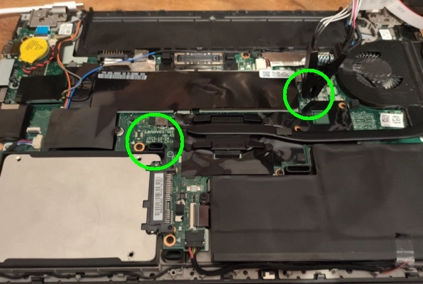
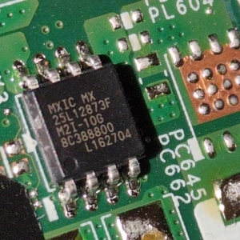
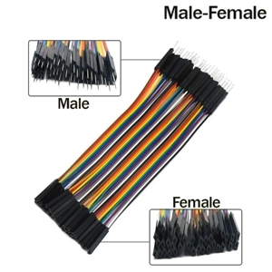
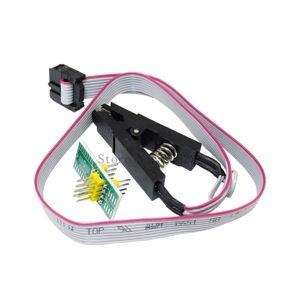
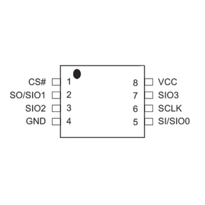
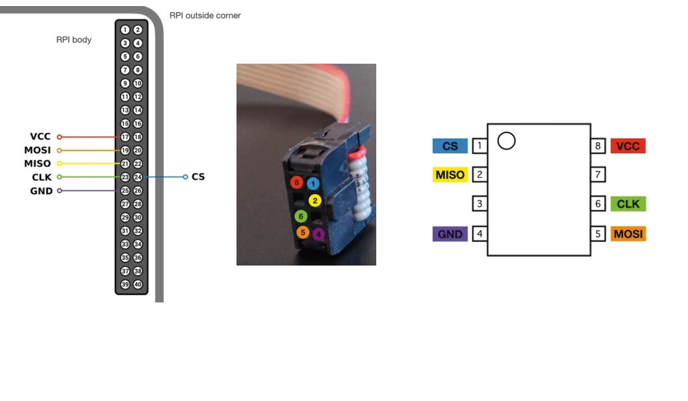
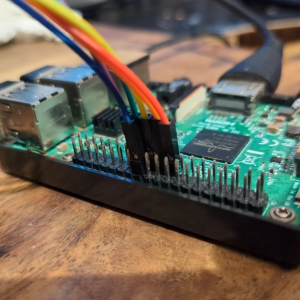
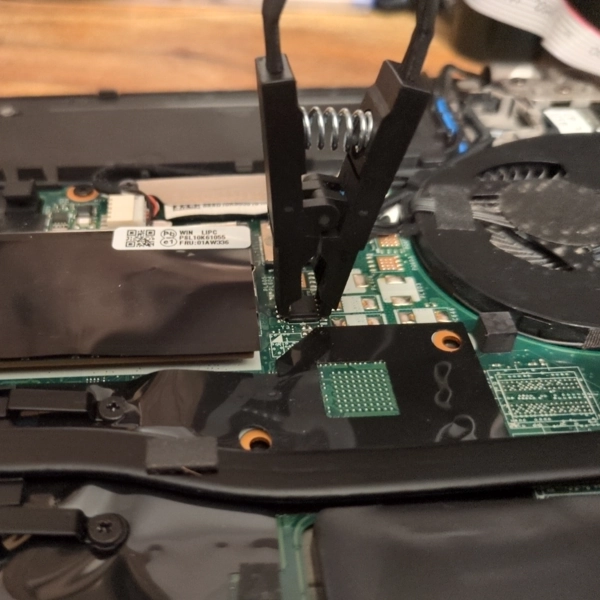

# Flashing the BIOS to Disable Intel ME on Lenovo Laptop T460 (ThinkPad)

Recently, I decided to flash the BIOS of my Lenovo ThinkPad T460 with a free or open-source implementation to disable Intel's backdoor as much as possible. After some research, I found that this specific model is not supported by Libreboot.

You can check if your laptop is supported here: [Libreboot Supported Hardware](https://libreboot.org/docs/install/#thinkpads).

**Note**: There are many detailed guides available online. This document serves as a reference for anyone planning to flash their laptop's BIOS.

**Computer details**:
- **Model**: Lenovo ThinkPad T460
- **Motherboard**: Lenovo BT462 NM-A581 Rev:3
- **Chip**: Macronix MXIC MX 25L12873F

**Summary**:
- [Chip location](#chip-location)
- [Flashing Setup](#flashing-setup)
- [Flashing Process](#flashing-process)
- [BIOS Dumps](#bios-dumps)

---

## Chip Location

Fortunately, this model has the BIOS chip located on the back of the motherboard. I only had to remove the battery and all visible screws. The motherboard model is in the center, and slightly to the right, near the heatsink fan, is the BIOS chip.





---

## Flashing Setup

I already had a Raspberry Pi at home, so I only needed to acquire a few extra components. You can find them at affordable prices on AliExpress with a quick search:

- **Raspberry Pi 3 Model B Rev 2** (around 45.00 USD)
- **Male-to-Female 10cm / 40-Pin Cable** (around 2.00 USD)
- **SOIC8/SOP8 Clip** (around 3.70 USD)

Here are some reference images to help you identify the components and setup:





Documentation: [MX25L12873F Datasheet](assets/MX25L12873F.pdf) (Page 7)









---

## Flashing process

### Backup the current ROM

Back up the original ROM to a file:

```bash
$ raspberry@raspberrypi:~ $ flashrom -p linux_spi:dev=/dev/spidev0.0,spispeed=10000 -c "MX25L12833F/MX25L12835F/MX25L12845E/MX25L12865E/MX25L12873F" -r original_dump.bin
# flashrom unknown on Linux 6.6.51+rpt-rpi-v7 (armv7l)
# flashrom is free software, get the source code at https://flashrom.org

# Using clock_gettime for delay loops (clk_id: 1, resolution: 1ns).
# Found Macronix flash chip "MX25L12833F/MX25L12835F/MX25L12845E/MX25L12865E/MX25L12873F" (16384 kB, SPI) on linux_spi.
# ===
# This flash part has status UNTESTED for operations: WP
# The test status of this chip may have been updated in the latest development
# version of flashrom. If you are running the latest development version,
# please email a report to flashrom@flashrom.org if any of the above operations
# work correctly for you with this flash chip. Please include the flashrom log
# file for all operations you tested (see the man page for details), and mention
# which mainboard or programmer you tested in the subject line.
# Thanks for your help!
# Reading flash... done.
```

Do it twice:

```bash
$ raspberry@raspberrypi:~ $ flashrom -p linux_spi:dev=/dev/spidev0.0,spispeed=10000 -c "MX25L12833F/MX25L12835F/MX25L12845E/MX25L12865E/MX25L12873F" -r original_dump_2.bin
# flashrom unknown on Linux 6.6.51+rpt-rpi-v7 (armv7l)
# flashrom is free software, get the source code at https://flashrom.org

# Using clock_gettime for delay loops (clk_id: 1, resolution: 1ns).
# Found Macronix flash chip "MX25L12833F/MX25L12835F/MX25L12845E/MX25L12865E/MX25L12873F" (16384 kB, SPI) on linux_spi.
# ===
# This flash part has status UNTESTED for operations: WP
# The test status of this chip may have been updated in the latest development
# version of flashrom. If you are running the latest development version,
# please email a report to flashrom@flashrom.org if any of the above operations
# work correctly for you with this flash chip. Please include the flashrom log
# file for all operations you tested (see the man page for details), and mention
# which mainboard or programmer you tested in the subject line.
# Thanks for your help!
# Reading flash... done.
```

Compare both dumps. If the `diff` command returns no output, it means the two files are identical. This indicates that the backup process was successful, and the original ROM has been accurately copied.

```bash
$ raspberry@raspberrypi:~ $ ls
# Bookshelf  Desktop  Documents  Downloads Music  original_dump_2.bin  original_dump.bin  Pictures  Public  Templates  Videos
$ raspberry@raspberrypi:~ $ diff original_dump.bin original_dump_2.bin 
```

### Applying ME cleaner

From this point on, it is best to follow the official ME Cleaner guide for [internal flashing with OEM firmware](https://github.com/corna/me_cleaner/wiki/Internal-flashing-with-OEM-firmware).

You can use the following outputs as a reference:

```bash
$ raspberry@raspberrypi:~/coreboot/util/ifdtool $ ./ifdtool -d ~/original_dump.bin 
# Warning: No platform specified. Output may be incomplete
# File /home/raspberry/original_dump.bin is 16777216 bytes
# ICH Revision: Unknown PCH
# FLMAP0:    0x00040003
#   NR:      0
#   FRBA:    0x40
#   NC:      1
# ...
# ...
# If you are interested in this output, you can find it in ifdtool_output.txt.
```

Run me_cleaner:

```bash
$ raspberry@raspberrypi:~/me_cleaner $ python me_cleaner.py ~/original_dump.bin 
# Full image detected
# Found FPT header at 0x3010
# Found 13 partition(s)
# Found FTPR header: FTPR partition spans from 0x1000 to 0x130000
# Found FTPR manifest at 0x1478
# ME/TXE firmware version 11.8.83.3874 (generation 3)
# Public key match: Intel ME, firmware versions 11.x.x.x
# The HAP bit is NOT SET
# Reading partitions list...
#  FTPR (0x00001000 - 0x000130000, 0x0012f000 total bytes): NOT removed
#  FTUP (0x00272000 - 0x000600000, 0x0038e000 total bytes): removed
#  DLMP (      no data here      , 0x00000000 total bytes): nothing to remove
#  PSVN (0x00000e00 - 0x000001000, 0x00000200 total bytes): removed
#  IVBP (0x0026e000 - 0x000272000, 0x00004000 total bytes): removed
#  MFS  (0x00130000 - 0x00026e000, 0x0013e000 total bytes): removed
#  NFTP (0x00272000 - 0x00057d000, 0x0030b000 total bytes): removed
#  ROMB (      no data here      , 0x00000000 total bytes): nothing to remove
#  WCOD (0x0057d000 - 0x0005fd000, 0x00080000 total bytes): removed
#  LOCL (0x005fd000 - 0x000600000, 0x00003000 total bytes): removed
#  FLOG (0x00600000 - 0x000601000, 0x00001000 total bytes): removed
#  UTOK (0x00601000 - 0x000603000, 0x00002000 total bytes): removed
#  ISHC (      no data here      , 0x00000000 total bytes): nothing to remove
# Removing partition entries in FPT...
# Removing EFFS presence flag...
# Correcting checksum (0xa3)...
# Reading FTPR modules list...
#  FTPR.man     (uncompressed, 0x001478 - 0x0021cc): NOT removed, partition manif.
#  rbe.met      (uncompressed, 0x0021cc - 0x002262): NOT removed, module metadata
#  fptemp.met   (uncompressed, 0x002262 - 0x00229a): NOT removed, module metadata
#  kernel.met   (uncompressed, 0x00229a - 0x002328): NOT removed, module metadata
#  syslib.met   (uncompressed, 0x002328 - 0x00238c): NOT removed, module metadata
#  bup.met      (uncompressed, 0x00238c - 0x00294e): NOT removed, module metadata
#  pm.met       (uncompressed, 0x00294e - 0x0029fc): NOT removed, module metadata
#  vfs.met      (uncompressed, 0x0029fc - 0x003460): NOT removed, module metadata
#  evtdisp.met  (uncompressed, 0x003460 - 0x0035ee): NOT removed, module metadata
#  loadmgr.met  (uncompressed, 0x0035ee - 0x003716): NOT removed, module metadata
#  busdrv.met   (uncompressed, 0x003716 - 0x003abe): NOT removed, module metadata
#  gpio.met     (uncompressed, 0x003abe - 0x003c08): NOT removed, module metadata
#  prtc.met     (uncompressed, 0x003c08 - 0x003db8): NOT removed, module metadata
#  policy.met   (uncompressed, 0x003db8 - 0x003f78): NOT removed, module metadata
#  crypto.met   (uncompressed, 0x003f78 - 0x004102): NOT removed, module metadata
#  heci.met     (uncompressed, 0x004102 - 0x0042ce): NOT removed, module metadata
#  storage.met  (uncompressed, 0x0042ce - 0x0045ca): NOT removed, module metadata
#  pmdrv.met    (uncompressed, 0x0045ca - 0x0046ee): NOT removed, module metadata
#  maestro.met  (uncompressed, 0x0046ee - 0x0047d8): NOT removed, module metadata
#  fpf.met      (uncompressed, 0x0047d8 - 0x0048f0): NOT removed, module metadata
#  hci.met      (uncompressed, 0x0048f0 - 0x0049f2): NOT removed, module metadata
#  fwupdate.met (uncompressed, 0x0049f2 - 0x004afa): NOT removed, module metadata
#  ptt.met      (uncompressed, 0x004afa - 0x004c06): NOT removed, module metadata
#  touch_fw.met (uncompressed, 0x004c06 - 0x004d40): NOT removed, module metadata
#  rbe          (Huffman     , 0x004d40 - 0x007c00): NOT removed, essential
#  fptemp       (LZMA/uncomp., 0x007c00 - 0x009c00): removed
#  kernel       (Huffman     , 0x009c00 - 0x019c40): NOT removed, essential
#  syslib       (Huffman     , 0x019c40 - 0x02b040): NOT removed, essential
#  bup          (Huffman     , 0x02b040 - 0x056000): NOT removed, essential
#  pm           (Huffman     , 0x056000 - 0x059440): removed
#  vfs          (Huffman     , 0x059440 - 0x066f80): removed
#  evtdisp      (Huffman     , 0x066f80 - 0x0698c0): removed
#  loadmgr      (Huffman     , 0x0698c0 - 0x06e6c0): removed
#  busdrv       (Huffman     , 0x06e6c0 - 0x072140): removed
#  gpio         (Huffman     , 0x072140 - 0x073e00): removed
#  prtc         (Huffman     , 0x073e00 - 0x074f80): removed
#  policy       (Huffman     , 0x074f80 - 0x080180): removed
#  crypto       (Huffman     , 0x080180 - 0x09af80): removed
#  heci         (LZMA/uncomp., 0x09af80 - 0x09ee40): removed
#  storage      (Huffman     , 0x09ee40 - 0x0a4ec0): removed
#  pmdrv        (Huffman     , 0x0a4ec0 - 0x0a6a40): removed
#  maestro      (Huffman     , 0x0a6a40 - 0x0ab6c0): removed
#  fpf          (Huffman     , 0x0ab6c0 - 0x0ae040): removed
#  hci          (LZMA/uncomp., 0x0ae040 - 0x0ae8c0): removed
#  fwupdate     (LZMA/uncomp., 0x0ae8c0 - 0x0b3600): removed
#  ptt          (LZMA/uncomp., 0x0b3600 - 0x0c8e80): removed
#  touch_fw     (LZMA/uncomp., 0x0c8e80 - 0x130000): removed
# The ME minimum size should be 372736 bytes (0x5b000 bytes)
# The ME region can be reduced up to:
#  00003000:0005dfff me
# Checking the FTPR RSA signature... VALID
# Done! Good luck!
```

Writing down the modified BIOS.

```bash
$ raspberry@raspberrypi:~/me_cleaner $ flashrom -p linux_spi:dev=/dev/spidev0.0,spispeed=10000 -c "MX25L12833F/MX25L12835F/MX25L12845E/MX25L12865E/MX25L12873F" -w ~/modified_image.bin
# flashrom unknown on Linux 6.6.51+rpt-rpi-v7 (armv7l)
# flashrom is free software, get the source code at https://flashrom.org
#
# Using clock_gettime for delay loops (clk_id: 1, resolution: 1ns).
# Found Macronix flash chip "MX25L12833F/MX25L12835F/MX25L12845E/MX25L12865E/MX25L12873F" (16384 kB, SPI) on linux_spi.
# ===
# This flash part has status UNTESTED for operations: WP
# The test status of this chip may have been updated in the latest development
# version of flashrom. If you are running the latest development version,
# please email a report to flashrom@flashrom.org if any of the above operations
# work correctly for you with this flash chip. Please include the flashrom log
# file for all operations you tested (see the man page for details), and mention
# which mainboard or programmer you tested in the subject line.
# Thanks for your help!
# Reading old flash chip contents... done.
# Erasing and writing flash chip... Erase/write done.
# Verifying flash... VERIFIED
```

---

## BIOS Dumps

In case you find this useful, I'll leave this here.

| File                                  | Motherboard | Chip |
| ------------------------------------- | ------------| -----|
| [original_dump.bin](assets/original_dump.bin) | Lenovo BT 462 NM-A581 Rev:3 | MX25L12873F |
| [modified_dump.bin](assets/original_dump.bin) | Lenovo BT 462 NM-A581 Rev:3 | MX25L12873F |
